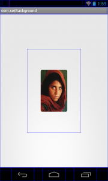

# TouchExtendView
觸碰範圍擴大View


##開發動機
傳統的按鈕有

效觸碰範圍可能就只有背景圖片的可視範圍內，但若是圖片很小的話會導致使觸碰有效範圍跟圖片一樣小會造成使用者使用上的不便，
因此開發此模組讓按鈕的有效觸碰範圍變大不再像以往就只有背景圖片那麼小。


##說明
TouchExtendView主要是可以讓觸控面積變大的一個View，可以內縮圖片的寬高大小。


模組提供的解決方法
使用者可以將原本按鈕view內的背景圖片內縮，因此雖然背景圖片看起來縮小了但是實際上觸碰有效範圍還是整個view


##示意圖

   


##使用說明

* 先設定按鈕佔整個畫面的大小
* 再將模組new出來並設定按鈕圖片的背景大小


```
LayoutParams LP = getLayoutParams(WH.getW(50),WH.getH(50));
LP.addRule(RelativeLayout.CENTER_IN_PARENT);
TouchExtendView TEV = new TouchExtendView(context);
TEV.setBackgroundWidth(50);
TEV.setBackgroundHeight(50);
TEV.setBackgroundBitmap(R.drawable.usericon);
TEV.setLayoutParams(LP);
this.addView(TEV);
```

##程式碼說明

* getWidth、getHeight 取得整個View的寬度與高度。

* flag參數是防止寬高為0的情況。

* drawBitmap 把背景圖畫上去。

```
protected void onDraw(Canvas canvas) {
    super.onDraw(canvas);
    this.DWidth = getWidth();
    this.DHeight = getHeight();
    if (flag != -1) {
      setbitmap(flag);
 }
    canvas.drawBitmap(ImageBG, getXPoint(), getYPoint(), new Paint());

```


* OnDetachedFromWindow 是View的生命週期的最後一個

* 把所有用到的Bitmap的圖片清空。


```
protected void onDetachedFromWindow() {
    super.onDetachedFromWindow();
  if(ImageBG!=null)ImageBG=null;
    System.gc();
  }
```


